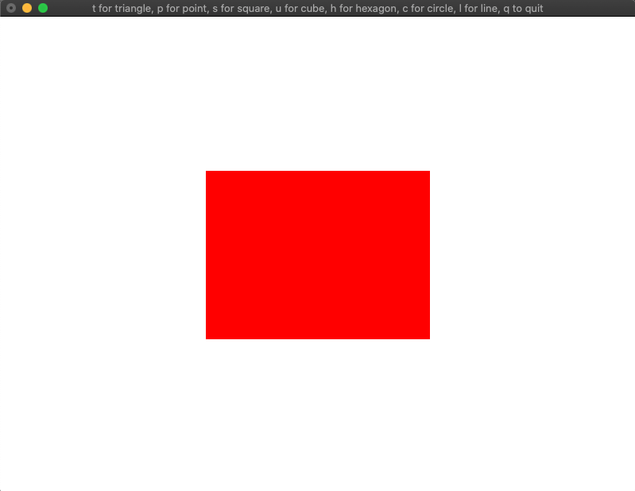

# OpenGL Shapes
Assignment for CS 5338 at Texas State University. A simple program to draw shapes on the screen using OpenGL in response to certain keyboard strokes.

## Directions
Compile: `g++ s1-mlanglais.cpp -framework OpenGL -framework GLUT -o s1`

Run: `./s1`

Press 't' for triangle, 'p' for point, 's' for square, 'u' for cube, 'h' for hexagon, 'c' for circle, 'l' for line, and 'q' to quit.

### Screenshots

